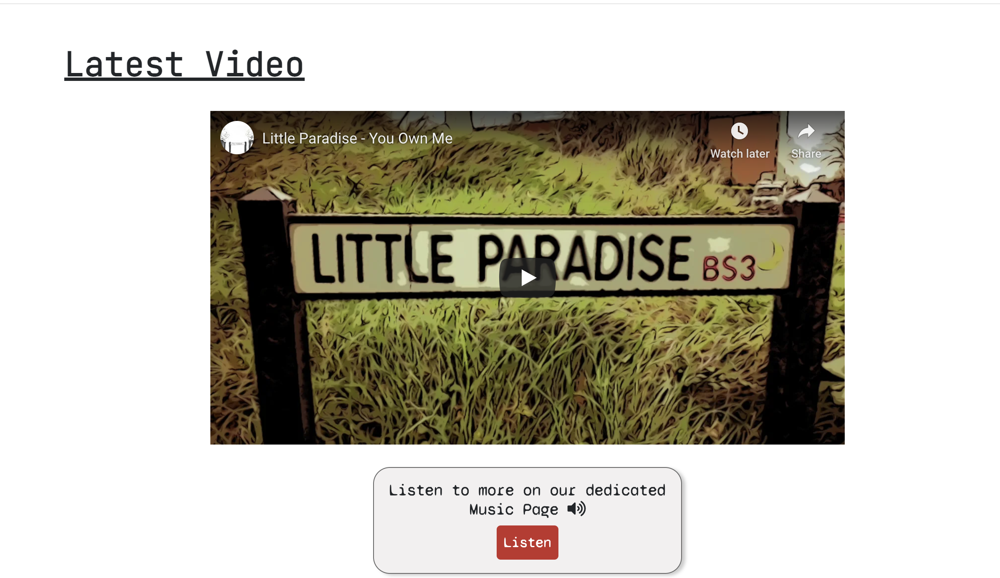

# Little Paradise - Band Website

## Code Institute's Milestone Project 1 - User Centric Front-End

Little Paradise are a musical duo who write and record songs from a home studio in Bristol. Having spent the best part of a year on creating new music, the band (of which I am one of the two members) has decided to build an online presence now that musical content is ready to be released to the world. My aim with this project is to create a website which can act as a convenient and memorable hub of music and informative content for users to consume. The website achieves this goal with combined functionality that is not readily available or as visually appealing on standard social media platforms such as Facebook.
 
The project is the first of four ‘milestone’ projects which are required to complete the Code Institute’s diploma in full stack web development. Assessment criteria for this milestone project focusses on the ability to produce a static, responsive front-end site using HTML and CSS learnt during the first part of the course.

You can view the live website [here](https://franciskershaw.github.io/little-paradise-music/index.html), and a link to the github repository can be found [here](https://franciskershaw.github.io/little-paradise-music/index.html)

## UX

My main goals for the creation of this website were as follows:

* Create a centralised platform that includes all of the features needed to start and nurture online engagement with a new music band.
* Create an aesthetically appealing website that leaves all users with a positive emotional response, regardless of whether their visit will convert them into fans of the band’s music or not.
* Demonstrate my new found competence in applying HTML and CSS to independently coded projects so as to meet the pass criteria of the Code Institute for this milestone project. 

### **User Stories**
 
#### **Band member (project *stakeholder*)**

As a member of Little Paradise:

1. I would like people to listen to our music in order to gain new fans.
2. I would like fans to know about upcoming tour dates so that they can buy tickets to gigs.
3. I would like to contact fans directly via email updates so that we can inform them about new releases, tour dates or general band news.
4. I would like booking agents or record labels who end up on our site to find contact details if they want inform us of any opportunities. 
5. I want potential fans to find our social links so that we can increase followers and engagement on our social platforms.
6. I want anyone who visits the site to have a positive emotional response to the layout of the site and branding, in order to make a lasting impression that sets us apart from other new bands. 

#### **Users**

1. As someone who has never heard of Little Paradise before, I would like to listen to the band’s music to help me decide if I should keep tabs on them.
2. As an existing fan who has already heard the band’s music before, I would like to know about any upcoming tour dates so that I can consider watching them live.
3. As an avid fan who has a keen interest in the band’s music, I would like to see photos and find out more about the band's history so that I can feel a slightly more personal connection to them away from the music.
4. As a booking agent or record label, I would like to easily find contact details so that I can directly approach the band regarding potential gigs or collaboration opportunities they might be interested in.

## Planning & Design

### **Strategy Plane**

The **user stories** as detailed in the previous section was the first part of the development process and was very helpful in deciding which features were critical to the success of the site. Features that I did not deem necessary to the band and users reaching the end of their journeys would not be considered.

The **focus** of the project is: 

* To provide Little Paradise (the stakeholder) with an area to consolidate relevant information about the band for fans and booking agents and to ensure all visitors reach the end of their user stories.

The **business goals** for the stakeholder are to:

* Create an online presence which will increase exposure and gain new fans. 
* Sell tickets to shows and music.
* Nurture new relationships with fans through email updates.

*The band therefore needed a bespoke website, as the current options provided by social media platforms are insufficient and too general to achieve their goals.*

While strategising, I researched as many band websites as possible and continued to use them as references throughout the development process. This was to ensure that I would remain consistent with the familiar conventions applied to band websites while ensuring my own goals were met. 

The following sites proved to be very useful when considering the features that would best help fulfil my user stories:

* [Foals](https://www.foals.co.uk/)
* [Palace](https://www.wearepalace.com/)
* [Bandzoogle Sample Sites](https://bandzoogle.com/sample-band-sites)
  * [Emily Kinney](https://emilykinneymusic.com/)
  * [Ships Have Sailed](https://shipshavesailed.com/)
  * [Scilla Hess](https://scillahess.com/)
  * [Flagship Romance](https://flagshipromance.com/)

Using the below importance vs viability metric, I was able to list out the opportunities on offer when creating the website and decide which ones were achievable, relevant and appropriate with regard to my user stories. 

Opportunity | Importance | Viability
------------ | ------------- | ------------- 
Create an online presence | 5 | 5
Have a gallery of photos | 3 | 4
Have a list of upcoming tour dates | 3 | 5
Showcase existing music | 5 | 3
Provide contact details | 4 | 5
Sell merchandise | 2 | 1
Provide song lyrics | 1 | 5
**Total** | **23** | **28**

I quickly concluded that the following common features of band websites would therefore be surplus to requirements:

* Selling merchandise - unecessary at this stage in the band's career and beyond my current skillset to implement.
* Song lyrics section - would contribute to content overload and wouldn't help fulfil any of my user stories.

### **Scope Plane**

Based on information I uncovered in the strategy plane, and considering any limitations of my current coding abilities, the features I decided were critical to include are as follows:

**Required functional specifications**
1. Somewhere to listen to the band's music.
2. A section for upcoming tour dates.
3. An area to find out more about the band's history.
4. A photo gallery.
5. A dedicated area to find out contact information or sign up to email updates.

**Content requirements of these features**

1. Music content must be easy to find and come from a variety of available and familiar music platforms.
2. Tour dates must provide concise, relevant information as well as links to buy tickets.
3. A Bio section which is entertaining and informative.
4. Any photos must be of good quality and engaging.
5. Contact information must be easy to find.

### **Structure Plane**

Bearing in mind the functional and content specifications outlined in the scope plane, I decided to create five unique pages for the site that could share responsibility for presenting the necessary features to allow users to reach the end of their journeys. 

1. A home page which draws the user in with a striking hero image, contains two call to actions directing users to the most highly prioritised content (music and email updates), and includes upcoming tour dates.
2. A music page that includes the currently available platforms through which a user could listen to the band’s music (SoundCloud and YouTube) and a section for available releases to purchase.
3. A gallery containing a variety of band related photos.
4. An about page which tells a brief history of the band up until present day.
5. A contact page (including sign-up option) to find contact details and sign up to email updates

#### Interaction Design

As the user stories varied a lot in terms of intended use for the website, the interaction design needed to be intuitive enough to allow users to quickly learn how to navigate the site and find exactly what they are looking for.

* A nonlinear structure (achieved via a fixed navigation bar on each page) would allow users to pick and choose sections they wish to navigate at any point during their journey.
* The active page would need to be highlighted to help the user understand where on the website they had arrived.
* Navigation links, as well as any other buttons or links as part of a page’s content, needed to change colour when hovered over or clicked on to provide user feedback.
* The same colour scheme and design themes have to be applied across all pages to maintain consistency.
* Where possible, secondary content on the page needed to appear just beyond the fold on as many screen sizes as possible to highlight the fact that the page can be scrolled through.
* A footer would provide social links and remain consistent across all pages

#### Information Architecture

* Tree structure should be implemented with use of navigation’s burger icon when on mobile devices.
* Priority on the navigation bar will go from left to right.
* Logo on the far left and features on the far right in the following order of importance: Tour, Music, Gallery, About, Contact
* The most important features will manifest in the CTAs: A link to the music page and a link to sign up for email updates.
* No user should have to click more than three times in order to fulfil their user story.

### **Skeleton Plane**

In order to properly visualise how my pages would be organised and linked together, I created some low fidelity mockups using [InVision](https://www.invisionapp.com/) - focussing on the design layout for small, medium and large screen sizes. The purpose of this process was to double check that the ideas I had begun formulating internally during the structure plane would be faithful to the user stories they were designed to fulfil. Any clear issues flagged up at this stage could then be fixed well before coding of the site started in earnest. 

When designing the layout of the site, my intention was to keep each page as user-friendly as possible by not having more than three unique interactable features per page. That way, the chance of cognitive overload could be vastly reduced, especially as each user story I was working towards had different intentions for the site.

For the most part, I felt satisfied at this stage that all my user stories would in theory be completed intuitively through the layout of my site. I did however spot during this process that users in my first user story (people who would be arriving primarily to consume music) may be frustrated that no interactable musical content appears on the home page at all. This was rectified in the final version of the site by including a small section below the primary call to actions which contained the same YouTube iframe present in the music page with a link to the music page for those who want to hear more.

### **Surface plane**

Little Paradise has never had an online presence or brand before the creation of this website, so deciding what kind of aesthetic to employ was not dictated by any pre-existing brand requirements or colour schemes. This provided a challenge, but also a great level of creative freedom to work with.

#### Typography

The starting point for the look and feel of the site came from and accidental discovery of the ‘Syne Mono’ font on Google Fonts. This minimalist typography instantly grabbed me as unique and retro, and in a way ended up informing many of the stylistic decisions that would be taken across the website.

An alternative monospace font, 'JetBrains Mono' was employed at various points (notably the tour dates section) to ensure the impact of the Syne Mono font wasn't diluted by overuse.

#### Colour Scheme

I chose to employ a predominantly black, white and grey colour scheme to complement the retro vibe that is given off by Syne Mono. A smattering of red #d85656 can be found assigned to important features - such as the call to action buttons or when hovering over navigation links. 

The use of this colour scheme is best exemplified by the hero image I comissioned especially for the site (a seriously impressive drawing by Izi Thexton) which keeps to the minimalist black and white palette with just a hint of red on the road sign.

#### Animations, transitions and effects

* 'Appear' animations are included across all 5 pages to introduce content in a consistent and impactful way.
* All links and buttons respond when being hovered over or clicked on to produce user feedback 
* Bootsrap transitions on the navigation links were tweaked slighly to produce a slightly more graceful transition when hovered over.

## Features

### Existing features

#### Consistent features

* Each page contains a fixed navigation bar which has the currently viewed page highlighted. At the mobile view the nav bar shrinks down into a conventional burger icon and the links grow to 200% of their original font size.
* The footer also remains consistent across the website, located at the bottom of each page and containing social links.
* Every link or button contains a hover effect to indicate that they are clickable.
* All pages (outside of the home page) contain the same styled *h1* to confirm which page of the site the user has reached.
* An appear animation (lifted from YouTube, please see acknowledgements) appears consistently across all pages to gracefully present content at each stage of the user journey. 
* All images (apart from the hero image) and *call to action* boxes contain a box-shadow effect which was lifted from css-tricks (please see acknowledgements).

#### index.html

* A hero image of the two band members holding guitars on either side of the Little Paradise road sign appears before anything else and is arguably the centerpiece of the website.
* Just below, two *call to action* boxes appear which direct users to the main music page and sign-up option for email updates. These contain icons from font awesome to add to the visual language of the site.
* If the user decides to continue scrolling, they will find a solitary YouTube video which exists to give site visitors a flavour of the band's music. This is reinforced with another *call to action* button directing users to the main music page should they wish to hear more.
* Below the video is a section dedicated to upcoming tour dates, venues and ticket links. This section is also accessible via the 'Tour' link on the main navigation menu across all pages.

#### music.html

* Below the main heading is an iframe to the band's SoundCloud playlist, containing all existing tracks available to listen to. The iframe has been tweaked ever so slightly so that the play icon and song progress bar are the same red (#d85656) as seen on the rest of the site.
* The same YouTube video from index.html has its own dedicated section on the music page, below the SoundCloud playlist.
* The relevant music icons that display in the *h2* tags of SoundCloud and YouTube double up as external links and are coloured to the exact hex codes of their real-life branding.
* Finally a card which acts as a purchase link for previously released music appears at the bottom of the music page in the form of a 'Releases' (Discography) section.

#### gallery.html

* The page contains 12 landscape and 12 portrait photos with rounded edges and box shadows.
* Images appear as 4 to a row on large screen sizes, 3 to a row on medium screen sizes, 2 to a row on small screen sizes and 1 to a row on extra small mobile devices. This signified a change from the wireframes created during mockups, as in practice mobile devices needed 1 photo per row to be viewed easily (original wireframes contained 2).
* A sepia filter was applied to all photos before uploading to give a consistent look to the page.

#### about.html

* After the main heading, a short biography of the band appears. Users who reach the end of the article are prompted by two more *call to action* buttons to either send them in the natural direction to the final page of the site (contact) or back home via the 'tour' section.
* The bio section is accompanied by two landscape photos. These appear on the left for larger screen sizes, but are split up into top and bottom of the article once the medium break point is reached.

#### contact.html

* Below the main heading, there is a box which contains the two primary contact email addresses needed to get in touch with the band - General Enquiries and Bookings.
* Both contact addresses contain a relevant and appropriate font awesome icon, a question mark for general enquiries and a book for bookings.
* The size of the content in the contact information box scales down at smaller screen sizes to ensure there is no overflow or text wrapping.
* Below the contact section is the area where users can sign up to email updates. Users who arrive here via the *call to action* box from index.html end up directly on this section without having to scroll down.

### Features left to implement

* I would eventually like to have the burger icon on the mobile menu change into an X close button. From research I've concluded this is be something I can implement once I'm more familiar with Javascript.
* Once the band has music available to listen to on Spotify, a Spotify playlist will replace SoundCloud on the music.html as this is a more familiar streaming platform and will thus induce a better emotional response from the user.
* Once the band has released several music videos, I would like to turn the YouTube section on music.html into an interactive carousel - allowing the user to choose which video to watch.

## Technologies used

### Languages and frameworks

* **HTML5:** Language used for structure and content across all pages.
* **CSS3:** Language used to style elements from the HTML pages.
* **Bootstrap:** CSS and JavaScript framework which allowed for the simple implementation of many template components, such as the navigation bar, the music releases card, and the grid system which greatly helped improve the responsiveness of each page.
* **JavaScript:** Language used to add some interactivity with the navigation bar: 
  * *Automatically applied through Bootstrap*: nav bar changes into the convential burger icon at smaller screen sizes.
  * *Code snippet (please see acknowledgements)*: collapses the mobile nav bar once a user clicks or presses any navigation link while on the home page so that the Tour section is not obstructed by the active navigation bar.

### Aditional Tools

* [Amiresponsive:](http://ami.responsivedesign.is/) Used to produce the hero image in README.md and check general responsivity of the pages.
* [FontAwesome:](https://fontawesome.com/) Large database of icons which I used for my social links, call to action boxes, contact information and email updates form.
* [Free Formatter:](https://www.freeformatter.com/html-formatter.html) Used to help ensure code was consistently formatted across all pages.
* [Google Docs:](https://docs.google.com/) Used for note taking and was where most of my readme was initially written.
* Google Desktop Developer Tools: Used for debugging and testing of responsiveness across several screen sizes.
* Google Remote Developer Tools: Used after deployment for live debugging on mobile devices.
* [Google Fonts:](https://fonts.google.com/) Provided my site with the 'Syne Mono' and 'JetBrains' fonts.
* [InVision:](https://www.invisionapp.com/) Used to create all of my wireframes at the beginning of the development process.
* [W3C CSS Validation Service:](https://jigsaw.w3.org/css-validator/) Confirmed that my CSS is legal.
* [W3C Markup Validation Service:](https://validator.w3.org/) Confirmed that my HTML code is legal.
* [WAVE:](https://wave.webaim.org/) Allowed me to evaluate and test the accessibility of the site.

## Git Commit Messages

I attempted throughout this project to commit as regularly as possible and to stick to the same formula I applied from the beginning of the development process. I imagine in the future I will tweak the applied format, but for this project my rules were as follows:

* Start comments where possible with a prefix that summarises what the commit is for, such as fix (for bugs), add, remove, amend, style, or docs (for anything added to README.md).
* Always use the imperative tense so that readers would read as *the purpose of this commit is to* - etc.
* Commit often, and where possible keep messages as short as possible.

At the time of writing, these are among my recent commit messages and illustrate the format I applied for this project:

## Testing

*In this section, you need to convince the assessor that you have conducted enough testing to legitimately believe that the site works well. Essentially, in this part you will want to go over all of your user stories from the UX section and ensure that they all work as intended, with the project providing an easy and straightforward way for the users to achieve their goals.*

*Whenever it is feasible, prefer to automate your tests, and if you've done so, provide a brief explanation of your approach, link to the test file(s) and explain how to run them.*

For any scenarios that have not been automated, test the user stories manually and provide as much detail as is relevant. A particularly useful form for describing your testing process is via scenarios, such as:*

* *Contact form:*
  1. *Go to the "Contact Us" page*
  2. *Try to submit the empty form and verify that an error message about the required fields appears*
  3. *Try to submit the form with an invalid email address and verify that a relevant error message appears*
  4. *Try to submit the form with all inputs valid and verify that a success message appears.*

*In addition, you should mention in this section how your project looks and works on different browsers and screen sizes.*

*You should also mention in this section any interesting bugs or problems you discovered during your testing, even if you haven't addressed them yet.*

*If this section grows too long, you may want to split it off into a separate file and link to it from here.*

## Deployment

*This section should describe the process you went through to deploy the project to a hosting platform (e.g. GitHub Pages or Heroku).*

*In particular, you should provide all details of the differences between the deployed version and the development version, if any, including:*

* *Different values for environment variables (Heroku Config Vars)?*
* *Different configuration files?*
* *Separate git branch?*
* *In addition, if it is not obvious, you should also describe how to run your code locally.*

I deployed the website to GitHub Pages, which was achieved as follows:

1. View the Little Paradise repository by going to the 'Your repositories' section on Github's navigation.
2. Go to settings, which is at the far right of the repository navigation next to insights.
3. Scroll down to the GitHub Pages section.
4. Select master branch in the Source section.
5. Select a theme (I chose the Jekyll theme).

More in depth information about GitHub Pages can be found [here.](https://pages.github.com/)

## Cloning

You are more than welcome to clone my project for whatever reason, just follow these steps:

1. On GitHub, navigate to the main page of the repository.
2. Click on the **Code** dropdown, located next to Add file.
   * To clone the repository using HTTPS, under "Clone with HTTPS", click the clipboard icon to copy the link. 
   * To clone the repository using an SSH key, including a certificate issued by your organization's SSH certificate authority, click Use SSH, then click the clipboard icon to copy the link. 
   * To clone the repository using GitHub CLI, click Use GitHub CLI, then click the clipboard icon to copy the link.
3. Open the Terminal.
4. Change the current working directory to the location where you want the cloned directory.
5. Type *git clone*, and then paste the URL you copied earlier.
6. Press **Enter** to create your local clone

More in depth information about cloning repositories, including how to clone a repository using GitHub Desktop, can be found [here](https://docs.github.com/en/github/creating-cloning-and-archiving-repositories/cloning-a-repository).

## Credits

### Content

* The drawing of the band which appears as a hero image on the home page (and as album art on the music page) was kindly provided by Izi Thexton.

* The band biography on about.html was written by Francis Kershaw.

### Media

* All photos on gallery.html and about.html were taken by Francis Kershaw and Mike Kilcooley.

* All songs which appear on index.html and music.html were written, recorded and produced by Francis Kershaw and Mike Kilcooley.

### Acknowledgements

* JavaScript code snippet at the bottom of index.html which automatically closes the mobile nav bar (thus fixing a UX issue) was written by Marta Szymanska and can be found on this [MDB Page](https://mdbootstrap.com/support/general/auto-close-navbar-when-click-on-link-responsive-mode/).

* Box shadow effects, applied to my *call to action* boxes and images, was researched from this [CSS-Tricks page](https://css-tricks.com/almanac/properties/b/box-shadow/).

* I learnt how to apply, before then tweaking, the appear animation seen across all pages from this [YouTube video](https://www.youtube.com/watch?v=zHUpx90NerM&ab_channel=TraversyMedia) by [Traversy Media](https://www.youtube.com/channel/UC29ju8bIPH5as8OGnQzwJyA) at around the 33 minute mark.

* I found out how to remotely debug the site on my mobile phone by following the instructions on [this blog post](https://blog.campvanilla.com/debug-website-on-mobile-device-5c27c8809d39) by [Abinav Seelan](https://medium.com/@abinavseelan).

* Loading attribute (loading="eager") which fixed the bug on my hero image for a few Android devices was found on this [GitHub repository](https://github.com/scott-little/lazyload) by [Scott Little](https://github.com/scott-little).

* Information on how to remove the built-in SoundCloud iframe overlay on mobile devices (thus fixing a UX issue) was found on [this stack overlow page](https://stackoverflow.com/questions/39625513/soundcloud-embedded-player-on-mobile) on the answer posted by [Markus](https://stackoverflow.com/users/9507413/markus). 

A huge thank you to the following for their help and feedback during the development of this project:

* Izi Thexton for the incredible hero image.
* The Slack community at the Code Institute for their invaluable user feedback.
* My tutor Aaron Sinnott for helpful advice at several stages.
* Mike Kilcooley for providing some extra photos for the gallery.
* All of the mates of mine who took time to test the website once it was deployed. 

