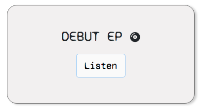
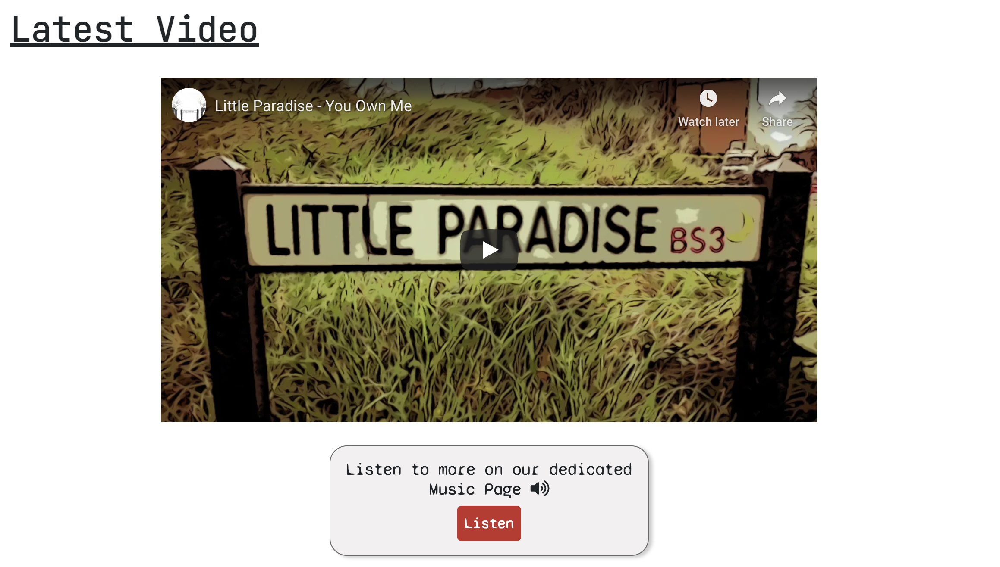
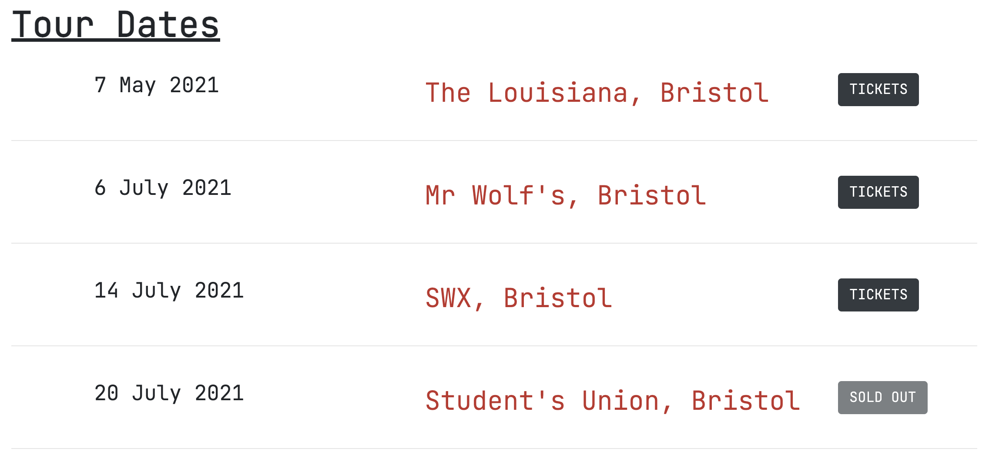
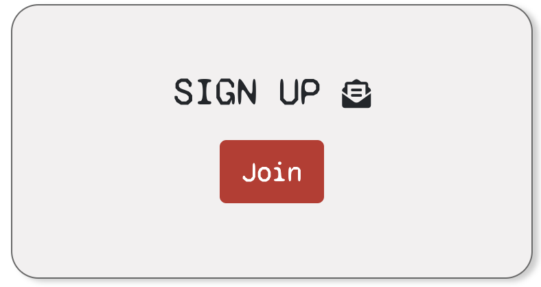
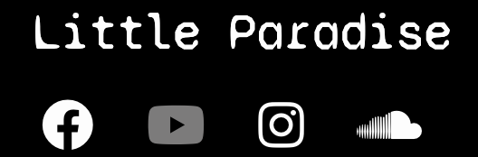

# Testing

Click [here](README.md) to return to the main report.

Testing for this project was carried out through the following methods:

* Constant review during development using Gitpod's browser previewers and Chrome developer tools.
* Manual user story testing during and after the writing of the code.
* Automated testing of the HTML and CSS pages using the WC3 validators.
* Automated testing of site's accessibility using the WAVE accessibility tool.

## Table of Contents

* [Testing During Development](#testing-during-development)
   * [Browser Preview and Chrome Developer Tools](#browser-preview-and-chrome-developer-tools)
   * [Post Deployment](#post-deployment)
   * [Notable Bugs](#notable-bugs-dealt-with-during-development)
* [User Story Testing](#manual-user-story-testing)
* [Stakeholder Story Testing](#manual-stakeholder-testing)
* [HTML Validator](#html-validator)
* [CSS Validator](#css-validator)
* [Accessibility Testing](#accessibility-testing)

## Testing During Development

### Browser Preview and Chrome Developer Tools

* Testing while writing the code was carried out using Gitpod's browser preview in order to make sure that written code was displaying as intended.
* While on the temporary browser previews, Google Chrome's developer tools were always in use to check for any console or performance errors, make temporary changes when required, and to check the responsiveness of my pages across a number of screen sizes. 

### Post Deployment

The same methods of testing were applied after deployment of the site to Github Pages to check that no unexpected bugs were showing on the live version of the site. The link to my site was also then sent to ten people with instructions to test on all available devices and browsers at their disposal. 

I asked the user testers to focus on the following:
   * Whether all internal and external links were working properly.
   * Whether there were any elements such as iframes or images that were not functioning or displaying as intended.
   * General feedback on the layout of the site.

*Note - one clear bug was spotted through this stage of user testing regarding the loading of the hero image on a small number of android devices using Google Chrome, please see below section on **notable bugs.***

I also sent my live site to the Code Institute's Slack community for peer review and general feedback, which returned the following notes:

* Loading animations on each page potentially a little bit too slow - **animation time and delay were tweaked for the final product to remedy this.**
* Concerns over the readability of the font - **consulted with more users and my mentor regarding this possible accessibility issue, increased font weight and size in relevant sections.**
* Images on the about page were stretched at certain breakpoints - **bootstrap grid amended and media query added ensure images were not compromised**

### Notable bugs dealt with during development

*Hero image lazy loading:*

I found once the site had been deployed that my hero image would not load on my phone unless the page was refreshed. User testing and feedback from the Slack community showed me that this issue was not widespread but was affecting a small number of Android devices while using Chrome.

To fix this bug, I researched how to use the Google Chrome developer tools remotely in order to debug directly on my phone as the issue wasn't showing on Gitpod's browser preview or on Chrome's mobile simulator on desktop developer tools. While debugging directly on my phone, I could see a warning message about 'lazy loading', which further research indicated was what was causing my image to remain unloaded on some mobile devices. **The attribute 'loading="eager" remedied the situation.**

**Note** - while the loading attribute did fix the issue to a certain extent, I found that the loading time of the image was still below the standard I was seeing on devices that did not previously have the issue. This is something that will require further research beyond the timeframe I have for this project at this current time, and I aim for it to be completely fixed in future iterations of the site.

*Hero image responsivity:*

In part due to the size and shape of the image being used, the hero image was not displaying in the intended way on smaller screen sizes. I was initially using the background-image property with a size property of 'contain', which meant at the medium breakpoint and below the image scaled down and ended up being placed well below the navigation bar once the screen size hit the medium breakpoint.

To fix this issue, I implemented Bootstrap's grid system with a fluid image within a column - that way it scaled down naturally with very little code. **A media query to extend the width of the image to 150% of the viewport was then applied so that the hero image was not too small when viewed on smaller screen sizes.**

*YouTube iframe responsivity:*

The YouTube iframe on the main page was appearing as an upward rectangle on mobile devices, which was not the intention and looked unnatural. This bug was caused by a class I had created to ensure that certain sections had their max-width reduced on mobile screen sizes. **The bug was fixed by moving the class to a different container that would only affect the desired elements.**

*Buttons changing to blue in 'focus' state*

I noticed that the customisation I had applied to the Bootstrap buttons did not extend as far as the 'focus' state as they changed to blue. **This was fixed by using the :focus pseudo class and using the same properties as my :active pseudo class.** 

**Note** - I was also not happy with the blue box that appears while a button is in focus so I overrode the default Bootstrap settings to have a thinner and lighter box appear instead

*Navigation bar not collapsing when clicking tour button on the home page:*

The tour dates section of the site is located on the home page and is accessible via the navigation bar from any page. However initially when navigating from the home page itself, users would have to manually close the navigation menu themselves to view the tour dates, which I interpreted as bad UX.

JavaScript was required to override Bootstrap's default navigation menu behaviour and close once a link was clicked, which was beyond my skillset to implement at this stage. **However, a useful code snipped found online and added to the bottom of my HTML fixed this bug for me - please see the acknowledgements section on the main [README page](README.md).** 

*Navigation links not all displaying in mobile landscape view*

I noticed that in landscape view on mobile devices, the large font-size of my navigation and social links meant that several clickable links were hidden and unreachable. While I understand that users navigating in landscape view on mobiles is uncommon - the bug bothered me enough to make a decent attempt to fix it. 

**This was initially fixed by using a landscape media query to reduce the font size when screens were flipped to landscape.** However, I rolled back this bug fix after seeing that the deployed version of my site was always being interpreted as landscape mode on desktop computers and laptops. This had unintended knock-on consequences for the spacing and styling of my navigation elements as a response to the landscape media query, so I decided this minor bug was not worth the investment of time to fix at this stage. I would however very much like to return to the site in the future when my skillset has improved to the stage where I can fix this bug properly.

*Contact information box sizing issue on certain screen sizes:*

My contact information box was sized to specification on my large iMac screen, as well as the preview sizes on chrome developer tools. However, while resuming coding on my newly repaired laptop, I noticed that the box had shrunk to half the intended size with the content spilling out onto the rest of the screen.

I realised that my use of the *vh* unit was misguided in this instance as this was what was causing the issue. **Changing the unit to pixels fixed this bug.**

## Manual User Story Testing

Testing my own user stories was carried out using the following criteria:
* The user journey must be intuitive.
* Each user must reach their end destination within three clicks.

### *1. As someone who has never heard of Little Paradise before, I would like to listen to the band's music to help me decide if I should keep tabs on them.*

* On the main navigation menu of every page, the first clickable link is that of the dedicated music page - where all available music is available to listen to. **Two clicks, one on the navigation link and one for the subsequent soundcloud playlist or YouTube video depending on preference.**

* If someone misses or disregards the main navigation menu, the very first piece of interactive content after the main hero image is a *call to action* box that directs straight to the music page. **Two clicks.**. 

* If the user decides to scroll further on the home page without clicking on either the navigation links or the *call to action* boxes, a YouTube video appears of the band's latest single followed by a further *call to action* box that again directs to the main music page. **One click.**. 

 

### *2. As an existing fan who has already heard the band’s music before, I would like to know about any upcoming tour dates so that I can consider watching them live.*

* The main navigation bar's second link is for 'Tour', which directs to the relevant section of the home page. **One click**. 

* If a user decides to scroll through the content on the home page first before using the navigation links, they will reach the tour section once they scroll past the YouTube video. **No clicks**. 

### *3. As an avid fan who has a keen interest in the band's music, I would like to see photos and find out more about the band's history so that I can feel a slightly more personal connection to them away from music.*

* From the main navigation bar, the user can click on the gallery link to go to the dedicated gallery page - where there are dozens of photos to scroll through of the band members and their recording setup. **One click**. 

* Next to the gallery link on the main navigation bar, the user can click on the about link to end up on a page with a short biography of the band. **One click, two in total to fulfil the entire user story**. 

### *4. As a booking agent or record label, I would like to easily find contact details so that I can directly approach the band regarding potential gigs or collaboration opportunities they might be interested in.*

* From the main navigation bar, the final link is one to the dedicated contact page. The very first thing that appears after the main heading are two separate email addresses to take note of depending on what you are intending on contacting the band for. **One click**. 

## Manual Stakeholder Testing

### *1. & 2. I would like people to listen to our music in order to gain new fans + I would like fans to know about upcoming tour dates so that they can buy tickets to gigs.*

* Please see above user stories 1 and 2.

### *3. I would like to contact fans directly via email updates so that we can inform them about new releases, tour dates or general band news.*

* A *call to action* box on the home page, placed right next to a link to the music page and above the taster YouTube video, directs interested users to the correct section of the contact page should they wish to receive email updates. **One click.**

During this stage of testing I found that the animation I had applied to have page content appear shortly after the heading contributed to poor UX for users navigating from the *call to action* box on the homepage as it meant waiting momentarily for the form to appear. **I elected to have all viewable content on the contact page appear at the same time to rectify this problem.**

*Note - the placement of this sign-up option is designed to combine the main user stories with the goals of the project stakeholder. The user is for the most part not on the website to sign up to updates, but this is something that the stakeholder would ideally like to happen. As such, the main directive to sign up to email updates is placed right in the middle of a section on the site where all kinds of users will arrive at intuitively on their journey, without applying unwanted pressure on the user.*

### *4. I would like booking agents or record labels who end up on our site to find contact details if they want to inform us of any opportunities.*

* Please see about user story 4.

### *5. I want potential fans to find our social links so that we can increase followers and engagement on our social platforms.*

* All of the band's social links can be found to the right of the main navigation bar, and also on the footer of each page. From research, these are the most conventional places to find social media links on a website like this. Therefore users for should subconsciously be expecting social media links in these places and can arrive there intuitively from any page on the site. **One click**. 

 

 

### *6. I want anyone who visits the site to have a positive emotional response to the layout of the site and branding, in order to make a lasting impression that sets us apart from other new bands.*

I am aware that what constitutes a positive emotional response is subjective depending on who is being asked. However, I have designed the website with the core principles of user experience design at the forefront, and have created a minimalist and intuitive layout through which users can easily navigate to reach their end destination. 

The layout and colour scheme has been kept consistent and positive emotional triggers come in the form of the elegant animations on each page which should mask loading times on most devices. General feedback on the whole has also been very positive about the user interface, which fills me with confidence that users of my site will want to come back.

## HTML Validator

### index.html
The initial run of testing on the W3C html validator showed two errors which were both to do with markup of the YouTube iframe.
* 'The frameborder attribute on the iframe element is obsolete. Use CSS instead.' - **frameborder attribute was removed from the html.**
* 'Text not allowed in element iframe in this context.' - p tag used within the iframe to display an error message for users of browsers which do not support iframes was flagging as an error on the validator. **Message removed as research shows wide cross browser support for iframes.**

Furthermore, one warning was displayed regarding the lack of a heading element within the section containing the hero image. **This was rectified by including an sr-only *h1* for the benefit of visually impared users.**

### music.html

The same iframe related errors that appeared in index.html were predictably present on music.html, and were promptly fixed in the way as previously mentioned.

Two further errors were flagged up and resolved:

* 'Bad value 100% for attribute width on element iframe: Expected a digit but saw % instead.' (SoundCloud iframe) - **width attribute was removed and added to CSS.**
* 'The scrolling attribute on the iframe element is obsolete. Use CSS instead.' (SoundCloud iframe) - **scrolling attribute was removed from the markup.**

### gallery.html

One warning appeared regarding the lack of a heading element within the section containing the photos. This was disregarded as the page heading itself (named 'Gallery') alongside the alt attributes added to every single img element was deemed sufficient for navigating the page using a screen reader.

### about.html

Two warnings appeared from the validator, again related to the recommended use of heading tags - first within the about section itself and then also the article tag housing the biography. Once again, I elected to disregard this warning on account of the page itself containing an *h1* (named 'About') which should indicate clearly the nature of the subsequent content.

### contact.html

One error was present on this page:

* 'The aria-describedby attribute must point to an element in the same document.' **This was rectified by amending the attribute to be named 'email', which matched the corresponding id and name attributes.**

## CSS Validator

No errors were found when running style.css through the W3C CSS validator.

## Accessibility Testing

### Color Contrast
Using the WAVE Accessibility Evaluation Tool, I found that the only clear error flagged across the pages was the contrast on my *call to action* buttons between the red I had chosen (#d85656) and the white text. After trying a few different shades, I settled on #c4302b (which is the same red used by YouTube in their logo) as a compromise between the lighter red I initially wanted and darker shades of red I was not satisfied with.

### Heading Elements 

WAVE also flagged that I had been skipping heading levels on most of the pages. I fixed this accessibility issue by ensuring these levels were not skipped, and by changing my footer logo from an *h4* to a *span*.

[Back to the top](#testing)

[Back to main document](README.md)